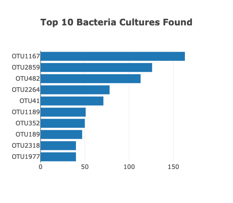
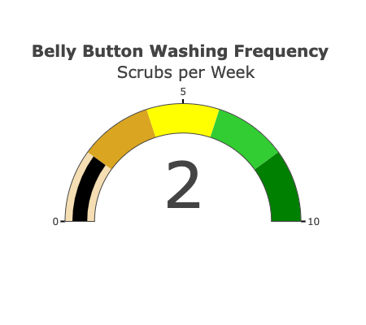
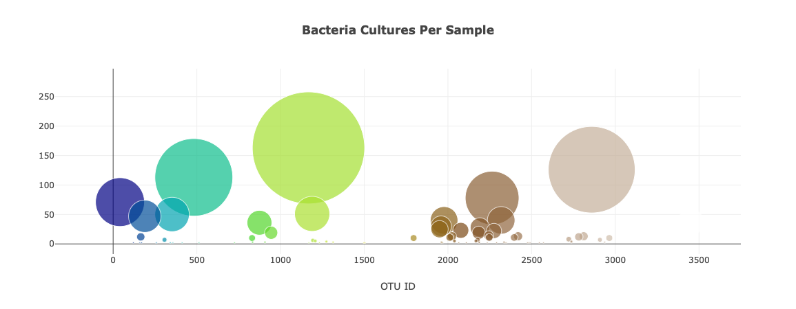

# Plotly_chart

Overview:

This project was to build a webpage using Plotly.js on an external data of different bacteria species studied. Tools used includes Javascript, HTML and Bootstrap script tags. Webpage customisations and interactive buttons such as the dropdown list was included to make it easier for users to navigate through the data output.

Results:
Some of the interactive visuals created include the following:
 * **Bar Chart**
 

  
 * **Gauge Chart**
 
 
 
 * **Bubble Chart**
 
 
 
 The results for the interactive website page is published [here](https://btwumdonkor.github.io/Plotly_chart/).
